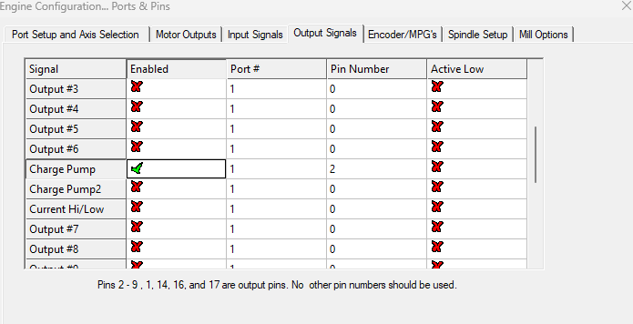

# Mach3_Charge_Pump_D1Mini(ESP8266)

## Note:
This project is based on this [YouTube video](https://www.youtube.com/watch?v=voYk2AVyjqQ). Please be aware that I am not a professional circuit board designer and this information is shared from a hobbyist's perspective. Implementing this project is at your own risk, and it's advised to consult with a professional if needed.

## Info:
The charge pump circuit prevents the spindle from unintentionally starting when not using Mach3 with a parallel port. Especially during power up or down of the pc, this can lead to the parallel port outputs being switched randomly, posing a safety risk. The circuit, reads the 25/12,5 Khz signal of Mach3 and enables/disables the machine via a relay.

The Webinterface of the D1Mini (ESP8266) provides a easy way to read the charge pump frequency and relay state and can be further extended as needed.

The D1 Mini can be flashed using OTA through the 'ip/update' page after the first inital flash.

## 

*Make sure to enable the charge pump feature in Mach3 and assign a free pin.*

